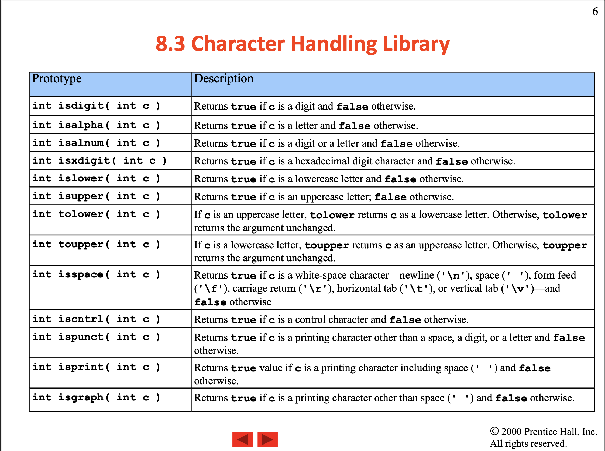

# Characters ans Strings
- Lecture 8: Characters and Strings ([Click here](/School%20Lectures/Lecture%208%20-%20Characters%20and%20Strings.pdf))

## Contents


## ASCII Overview
- General table:


- Detail table:

| Types | Description | Positions | Examples |
|-------|-------------|-----------|----------|
| Control characters | Non-printing character (NPC) | 0 -> 31, 127 | `NUL SOH STX ... DEL`|
| Printable characters | Printing character (PC) | 32 -> 126 | `! " # $ % ... ~` |
| White-space characters | | | `"" "\n" "\t" "\v" "\f" "\r"` |
| Graphic characters | Readable character (RC) | 33 -> 126 | `! " # $ % ... ~` |
| Punctuation characters | | 33 -> 47, 58 -> 64, 91 -> 96, 126 | `! " # $ % ... ~`|
| Digit characters | Numbers (integers) | 48 -> 57 | `0 1 2 3 4 5 6 7 8 9`|
| Alphabet characters | Alphabets | 65 -> 90, 97 -> 122 | `A B C D ... a b c d e f g ...`|

- Code to print all the ASCII characters:
```C
     #include <stdio.h>
     #include <ctype.h>

     int main() {
          int i;
          printf("All punctuations in C: \n");

          // looping through all ASCII characters
          for (i = 0; i <= 127; ++i) {
               printf("%c ", i);
          }
          return 0;
     }
```

## Character Handling Library - <ctype.h>
- **C <ctype.h>**: The C <ctype.h> header file declares a set of functions to classify (and transform) individual characters. For example, isupper() checks whether a character is uppercase or not.
- [Click here](https://www.programiz.com/c-programming/library-function/ctype.h) to know more the library.
- Return value:

| Return value | Boolean |
|--------------|---------|
| Non-zero integer | True |
| Zero (0) | False |




